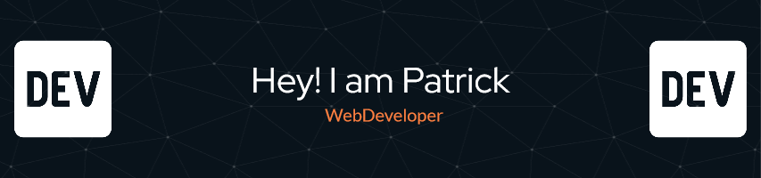

### 

---

## 👋 Hi, I'm Patrick

- 🎂 32 years old  
- 🇩🇪 Based in Germany  
- 💼 Mid Level Full Stack Developer at **Omos Media GmbH**  
- 🛍️ Focused on Shopify development & custom app solutions  
- 🤖 Interested in AI, automation & backend systems  
- 📚 Certified Scrum Master (2025)  
- 🔁 Career switcher from automotive industry to tech  

---

## 🚀 What I’m Working On

- Shopify theme & app development  
- Backend services & API integrations  
- Automation projects (Python / Node.js)  
- AI-powered tools & semantic search experiments  

---

## 🛠 Tech Stack

### JavaScript / TypeScript Ecosystem

### Frontend

### Backend & Databases

### DevOps / Infrastructure

### Tools

---
<!--
## 📊 GitHub Stats

---
-->

## ⚡ Recent Activity
<!--START_SECTION:activity-->
<!--END_SECTION:activity-->

---

💬 Always open to interesting collaborations around:
- Shopify Apps  
- Automation tools  
- AI-powered systems  
- Developer tooling  
